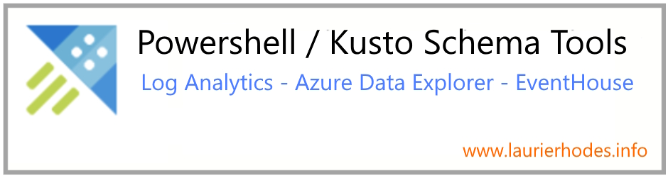

 

  
  
  

---

## 🔨 **Purpose**

The tools in this repository are written to managing data interchange between Azure Data Explorer (ADX), EventHouse and Microsoft Sentinel. 

*The PowerShell scripts are used for:*

* Exporting Sentinel and Log Analytics table schemas to Azure Data Explorer (ADX) and Eventhouse KQL scripts

* Automating Data Collection Rule creation to write data to Log Analytics / Sentinel tables

* Extending Log Analytics with new Custom Log (_CL_) tables

* Testing writeable tables in Log Analytics / Sentinel

* Creating Log Analytics / Sentinel tables and Data Collection Rules from JSON schemas

---

## 💎 **Enterprise Assets Included**

- **400+ Production DCR Templates**: Bicep deployment packages for _CL definitions for most major security vendors
- **400+ Bicep Table Definitions**: Infrastructure-as-code examples for extending Log Analytics custom tables  
- **1000+ KQL Table Definitions**: KQL schema templates derived from Log Analytics and the Sentinel archive to serve as templates fore data engineering.  
- **Hybrid Schema Discovery**: Combines Management API with runtime getschema queries for complete coverage
- **PowerShell scripts**: The raw scripts for exporting schema and creatting Data Collection Rules when required

---

## 📚 **Documentation**

- **[Complete Technical Documentation](docs/README.md)** - Detailed usage for all tools

---

## 📂 **Repository Structure**

### Schema Export & Discovery

- **`adx-to-json-export.ps1`** - Extract schemas from Azure Data Explorer clusters
- **`log-analytics-to-json-export.ps1`** - Comprehensive Log Analytics workspace schema export
- **`LogAnalyticsCommon.psm1`** - Core module with empirical Microsoft API bug fixes

### Infrastructure-as-Code Generation

- **`json-to-bicep-dcr-export.ps1`** - Generate DCR templates with correct output stream logic
- **`json-to-bicep-table-export.ps1`** - Create Log Analytics table definitions with dataTypeHint optimization
- **`json-to-adx-kql-export.ps1`** - ADX table creation with ingestion mapping automation

### Direct Export Workflows

- **`log-analytics-to-adx-kql-export.ps1`** - Direct cross-platform schema migration  
- **`log-analytics-to-bicep-dcr-export.ps1`** - Production DCR generation from live schemas

---

## 📁 **Production Example Archives**

This repository contains the **largest known collection** of production-ready Data Collection Rules and Bicep table definitions for enterprise security platforms.

| Directory                                                             | Contents                           | Count   | Description                                                                                                                                                  |
| --------------------------------------------------------------------- | ---------------------------------- | ------- | ------------------------------------------------------------------------------------------------------------------------------------------------------------ |
| [`bicep-tables-from-json/`](bicep-tables-from-json)                   | **Bicep Table Definitions**        | 400+    | Complete Log Analytics custom table definitions with deployment automation for major security vendors (Corelight, CrowdStrike, SentinelOne, Palo Alto, etc.) |
| [`dcr-from-json/`](dcr-from-json)                                     | **Data Collection Rule Templates** | 400+    | DCR Bicep templates with parameters files  for enterprise security data sources                                                                              |
| [`kql-from-loganalytics/`](kql-from-loganalytics)                     | **KQL Table Creation Scripts**     | 700+    | Complete KQL table definitions extracted from Log Analytics for ADX and EventHouse deployment, covering Microsoft native and custom security tables          |
| [`kql-from-json/`](kql-from-json)                                     | **Generated KQL Scripts**          | 400+    | KQL table definitions generated from JSON schema exports                                                                                                     |
| [`json-exports/`](json-exports)                                       | **JSON Schema Files**              | 400+    | Standardised JSON schema exports from the Sentinel Github Repo                                                                                               |
| [`json-exports-from-log-analytics/`](json-exports-from-log-analytics) | **JSON Schema Files**              | 700     | Standardised JSON schema exports from Log Analytics                                                                                                          |
| [`docs/`](docs)                                                       | **Technical Documentation**        | 8 files | Comprehensive implementation guides for all scripts                                                                                                          |

## 📄 **License & Support**

- **License**: Shared under MIT License.
