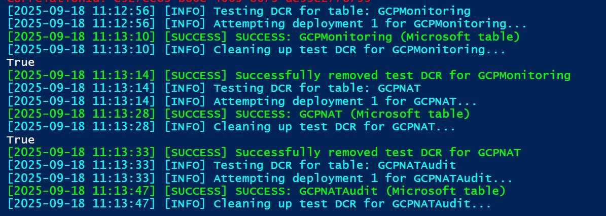

# Bulk DCR Deployment Test Script

## Overview

The `bulk-dcr-deployment-test.ps1` script validates Data Collection Rule (DCR) deployments in bulk to determine which Microsoft tables are actually writable via DCRs and verify the correct output stream naming convention (Microsoft- vs Custom- prefixes).



Different solutions added to a Log Analytics Workspace enabled different tables which may or may not be writeable via REST.  The only way to test what can receive event input is by trying to deploy exported Data Collection Rules against a workspace.

## Purpose

- **Validate DCR Templates**: Test all generated DCR Bicep templates for deployment errors
- **Identify Writable Tables**: Determine which Microsoft tables support DCR ingestion
- **Verify Output Streams**: Confirm whether tables use `Microsoft-` or `Custom-` output stream prefixes
- **Error Analysis**: Categorize failures to improve template generation logic

## Prerequisites

- **Azure PowerShell**: Az.Resources module installed
- **Azure Authentication**: Valid Azure session with deployment permissions
- **Resource Dependencies**: 
  - Data Collection Endpoint (DCE) 
  - Log Analytics Workspace
  - Service Principal with Monitoring Metrics Publisher role

## Configuration

Update the configuration section in the script:

```powershell
# Azure Configuration
$resourceGroupName = 'YOUR-RESOURCE-GROUP-NAME'
$workspaceName = 'YOUR-WORKSPACE-NAME'  
$workspaceResourceId = '/subscriptions/.../workspaces/YOUR-WORKSPACE-NAME'
$dataCollectionEndpointId = '/subscriptions/.../dataCollectionEndpoints/YOUR-DCE-NAME'
$servicePrincipalObjectId = 'YOUR-SERVICE-PRINCIPAL-OBJECT-ID'
$location = 'e.g. Australia East'

# Script Configuration
$dcrDirectory = Join-Path $PSScriptRoot "dcr"
$whatIfMode = $false          # Validate templates without deploying
$testMode = $false            # Test only first 5 DCRs
$includeOnly = @()            # Test specific tables only
$excludeTables = @()          # Exclude specific tables
```

## CSV Export

Detailed results are exported to:

```
dcr-deployment-test-results-YYYYMMDD-HHMMSS.csv
```

# Current Microsoft Sentinel Writeable Tables

September 2025 writeable tables (non-DataLake Sentinel)

| Writeable table                |
| ------------------------------ |
| ADAssessmentRecommendation     |
| Anomalies                      |
| ASimAuditEventLogs             |
| ASimAuthenticationEventLogs    |
| ASimDhcpEventLogs              |
| ASimDnsActivityLogs            |
| ASimFileEventLogs              |
| ASimNetworkSessionLogs         |
| ASimProcessEventLogs           |
| ASimRegistryEventLogs          |
| ASimUserManagementActivityLogs |
| ASimWebSessionLogs             |
| AWSCloudTrail                  |
| AWSCloudWatch                  |
| AWSGuardDuty                   |
| AWSNetworkFirewallAlert        |
| AWSNetworkFirewallFlow         |
| AWSNetworkFirewallTls          |
| AWSRoute53Resolver             |
| AWSS3ServerAccess              |
| AWSSecurityHubFindings         |
| AWSVPCFlow                     |
| AWSWAF                         |
| AzureAssessmentRecommendation  |
| CommonSecurityLog              |
| CrowdStrikeAlerts              |
| CrowdStrikeDetections          |
| CrowdStrikeHosts               |
| CrowdStrikeIncidents           |
| CrowdStrikeVulnerabilities     |
| DnsAuditEvents                 |
| Event                          |
| GCPApigee                      |
| GCPAuditLogs                   |
| GCPCDN                         |
| GCPCloudRun                    |
| GCPCloudSQL                    |
| GCPComputeEngine               |
| GCPDNS                         |
| GCPFirewallLogs                |
| GCPIAM                         |
| GCPIDS                         |
| GCPMonitoring                  |
| GCPNAT                         |
| GCPNATAudit                    |
| GCPResourceManager             |
| GCPVPCFlow                     |
| GKEAPIServer                   |
| GKEApplication                 |
| GKEAudit                       |
| GKEControllerManager           |
| GKEHPADecision                 |
| GKEScheduler                   |
| GoogleCloudSCC                 |
| GoogleWorkspaceReports         |
| IlumioInsights                 |
| SCCMAssessmentRecommendation   |
| SCOMAssessmentRecommendation   |
| SecurityEvent                  |
| SfBAssessmentRecommendation    |
| SPAssessmentRecommendation     |
| SQLAssessmentRecommendation    |
| Syslog                         |
| UCClient                       |
| UCClientReadinessStatus        |
| UCClientUpdateStatus           |
| UCDeviceAlert                  |
| UCDOAggregatedStatus           |
| UCDOStatus                     |
| UCServiceUpdateStatus          |
| UCUpdateAlert                  |
| WindowsEvent                   |